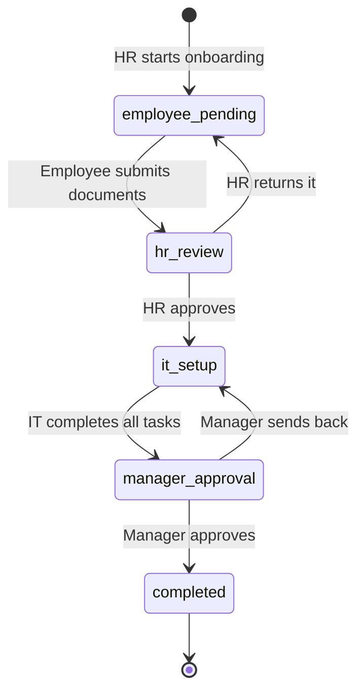

# Onboard: Backend API

REST API for an employee onboarding system. It takes a new hire from the moment HR creates their account to the day the manager gives the final approval, with every role seeing only what it should.

🔗 **Frontend repository:** [onboarding-frontend](https://github.com/Radi1n/onboarding-frontend)

## What it does

1. **HR** creates an employee and starts their onboarding. A checklist is generated automatically from task templates.
2. The **employee** uploads their national ID and signed contract, then submits.
3. **HR** reviews each document (approve, or reject with a reason). Approving everything sends it to IT.
4. **IT** completes the setup tasks (email, laptop, system accounts).
5. The **manager** gives the final approval, or sends it back to IT with a note.
6. Everyone involved gets notified at each step, and every action is recorded in an audit log.



## Features

- Token authentication with Laravel Sanctum
- Role-based access control (admin, HR, manager, IT, employee) enforced by middleware and per-record checks
- Onboarding state machine with validation, so steps cannot be skipped
- Checklist generated from task templates inside a database transaction
- Private document storage: files are never public and are served through an authorized endpoint
- In-app notifications and a full audit log (who did what, and when)
- Dashboard statistics scoped to each role

## Tech stack

Laravel 13, PHP 8.3, MySQL 8, Laravel Sanctum

## Roles

| Role | Can do |
|---|---|
| Admin | Everything, including departments and the audit log |
| HR | Create employees, start onboarding, review documents |
| Employee | Upload own documents and submit |
| IT | Complete IT setup tasks |
| Manager | Final approval for their own team |

## API overview

| Method | Endpoint | Access |
|---|---|---|
| POST | `/api/auth/login` | Public |
| GET | `/api/me` | Authenticated |
| GET | `/api/dashboard/stats` | Authenticated (scoped by role) |
| GET, POST, PUT, DELETE | `/api/departments` | Read: all. Write: admin |
| GET, POST, PUT | `/api/employees` | Read: scoped. Write: HR, admin |
| POST | `/api/employees/{id}/onboarding` | HR, admin |
| GET | `/api/onboardings/{id}` | Scoped by role |
| POST | `/api/onboardings/{id}/submit` | Employee |
| POST | `/api/onboardings/{id}/hr-decision` | HR, admin |
| POST | `/api/tasks/{id}/complete` | IT, admin |
| POST | `/api/onboardings/{id}/manager-decision` | Manager, admin |
| POST | `/api/onboardings/{id}/documents` | Employee, HR |
| PATCH | `/api/documents/{id}/review` | HR, admin |
| GET | `/api/documents/{id}/download` | Authorized users |
| GET | `/api/notifications` | Authenticated |
| GET | `/api/audit-logs` | Admin |

## Getting started

Requirements: PHP 8.3+, Composer, MySQL.

```bash
git clone https://github.com/Radi1n/onboarding-system.git
cd onboarding-system
composer install
cp .env.example .env
php artisan key:generate
```

Create an empty MySQL database named `onboarding_system`, check the `DB_*` values in `.env`, then:

```bash
php artisan migrate --seed
php artisan serve
```

The API runs on `http://127.0.0.1:8000`. To allow a frontend on another origin, set it in `config/cors.php`.

### Demo accounts

All seeded accounts use the password `password123`. These are for local development only.

| Role | Email |
|---|---|
| Admin | `admin@example.com` |
| HR | `hr@example.com` |
| Manager | `manager@example.com` |
| IT | `it@example.com` |

Employees are created by HR from the web app.

## Roadmap

- [x] Authentication and roles
- [x] Departments and employees
- [x] Onboarding flow with documents
- [x] Notifications and audit log
- [ ] Automated tests
- [ ] Email notifications